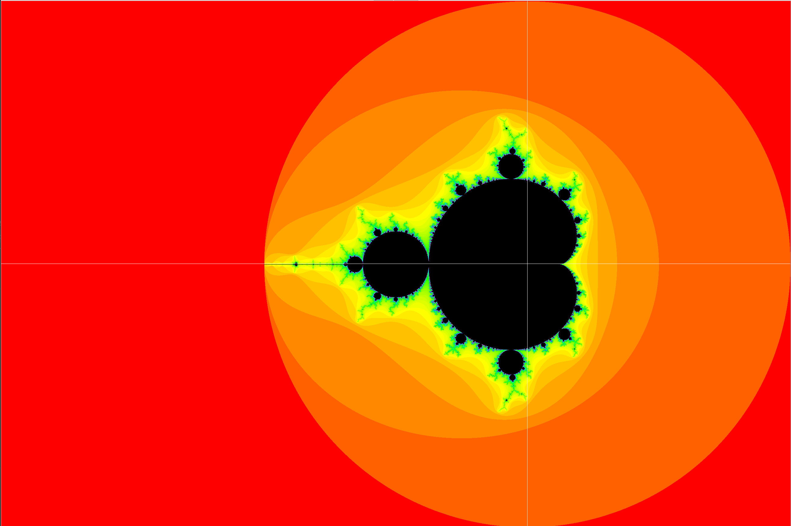

# Mandlebrot set - Archived

The mandlebrot set is a fractal set in the complex plane. Check out: [Mandelbrot set](https://en.wikipedia.org/wiki/Mandelbrot_set). The iterative equation is in the wikipedia page.

Here is a sample image of the output:
